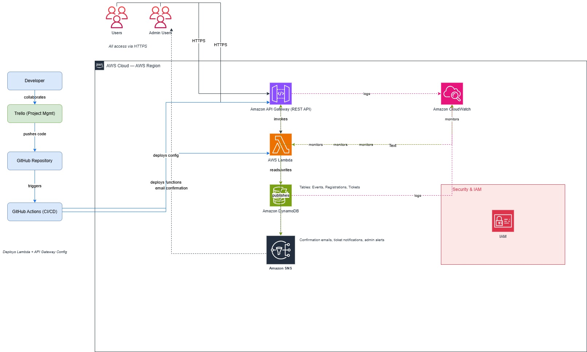

HEAD
# Architecture Overview

## System Architecture

### Data Flow
1. User visits frontend (S3 + CloudFront)
2. Frontend calls API Gateway
3. API Gateway routes to Lambda
4. Lambda processes business logic
5. Lambda reads/writes to DynamoDB
6. SNS sends confirmation email
7. CloudWatch logs everything

### DynamoDB Single-Table Design

| Item Type | PK | SK | GSI1PK | GSI1SK |
|-----------|----|----|--------|--------|
| Event | EVENT#<id> | METADATA | — | — |
| Registration | EVENT#<id> | REG#<email> | REG#<email> | EVENT#<id> |

### Security Layers
- **Transport:** HTTPS (ACM + CloudFront)
- **API:** API Gateway throttling + CORS
- **Data:** DynamoDB encryption at rest
- **Access:** IAM least privilege + OIDC
- **Monitoring:** CloudWatch Alarms + SNS

## Architecture Overview

This diagram illustrates a fully serverless AWS architecture for an **Event Registration & Ticketing System**, replacing a manual Microsoft Forms/Excel-based workflow with a scalable, automated, API-driven platform.

**User Access:**
Event participants, web browser users, mobile users, and admin users all interact with the system over **HTTPS**, sending requests to a central **Amazon API Gateway** exposing a REST API with endpoints for registering attendees, listing events, retrieving tickets, viewing registrations, and deleting registrations.

**Application Logic:**
API Gateway invokes **AWS Lambda** functions that handle all business logic — validating requests, generating ticket IDs, storing registrations, retrieving event/ticket data, and triggering confirmation emails. This removes the need for always-on servers, so the system only incurs cost when it's actually processing requests.

**Data & Notifications:**
Lambda reads from and writes to **Amazon DynamoDB**, which stores Events, Registrations, and (optionally) Tickets in a fully managed, low-latency NoSQL database. After a successful registration, Lambda publishes a message to **Amazon SNS**, which sends the confirmation email and can also handle ticket notifications and admin alerts.

**Observability & Cost Control:**
**Amazon CloudWatch** collects logs, metrics, and errors from API Gateway, Lambda, and DynamoDB, giving real-time visibility into application health (dashed lines). **AWS Budgets** independently tracks usage and spend across all core services (Lambda, API Gateway, DynamoDB, SNS, CloudWatch) to keep the project within AWS Free Tier limits and alert on cost overruns.

**Security:**
A dedicated **Security & IAM** group enforces least-privilege access through a Lambda execution role, scoped IAM policies, a CloudWatch logs role, and API Gateway permissions — ensuring each component can only access what it needs.

**CI/CD & Project Management:**
Outside the AWS boundary, a **Developer** pushes code to a **GitHub Repository**, which triggers **GitHub Actions** to automatically deploy Lambda functions and API Gateway configuration — replacing the organization's previous unstructured deployment process. **Trello** is used solely for task/project management and is intentionally kept separate from the application's data flow.

**Key AWS Services Used:** API Gateway, Lambda, DynamoDB, SNS, CloudWatch, AWS Budgets, IAM.
e13ab4f (Architecture design added)
